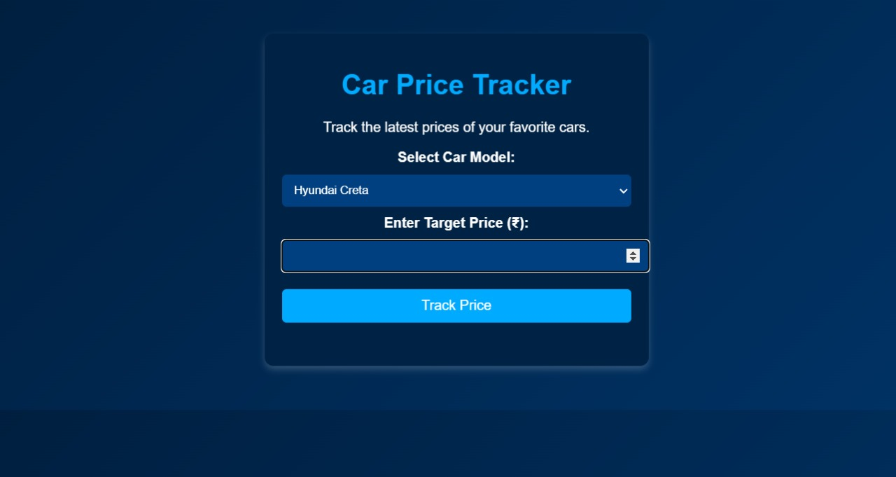

# 🚗 Car Price Tracker

A car price tracking web application built with Python Flask that monitors vehicle prices across multiple platforms and alerts users when prices drop or match their target budget.

## 📋 Features

- **Real-time Price Monitoring**: Track car prices from various online marketplaces
- **Price History**: View historical price data
- **Alert System**: Get notified when prices drop below your target
- **Multi-platform Support**: Monitor listings from multiple car marketplaces
- **Price Comparison**: Compare prices across different platforms
- **Saved Searches**: Save your favorite car searches for quick access
- **Simple UI**: Clean and responsive HTML interface

## 🚀 Getting Started

### Prerequisites

- Python 3.7 or higher
- pip (Python package manager)
- SQLite (comes with Python) or MySQL/PostgreSQL

### Installation

1. Clone the repository
```bash
git clone https://github.com/divyanz/codecar-price-tracker.git
cd codecar-price-tracker
```

2. Create a virtual environment
```bash
python -m venv venv

# On Windows
venv\Scripts\activate

# On macOS/Linux
source venv/bin/activate
```

3. Install required packages
```bash
pip install -r requirements.txt
```

4. Set up environment variables
```bash
cp .env.example .env
```

Edit `.env` and add your configuration:
```
FLASK_APP=app.py
FLASK_ENV=development
SECRET_KEY=your_secret_key_here
DATABASE_URI=sqlite:///carprice.db
EMAIL_USER=your_email@gmail.com
EMAIL_PASSWORD=your_app_password
```

5. Initialize the database
```bash
python init_db.py
```

6. Run the application
```bash
flask run
```

Or:
```bash
python app.py
```

The application will be available at `http://localhost:5000`

## 📖 Usage

### Adding a Car to Track

1. Go to the homepage
2. Click on "Add New Car" button
3. Enter car details:
   - Car Make (e.g., Honda, Toyota)
   - Car Model (e.g., Civic, Camry)
   - Year
   - Listing URL
   - Target Price (optional)
4. Click "Start Tracking"

### Viewing Tracked Cars

- All tracked cars are displayed on the dashboard
- Click on any car to view detailed price history
- See current price, lowest price, and price trends

### Setting Up Alerts

1. Navigate to a tracked car
2. Set your desired alert price
3. Enable email notifications
4. Receive alerts when price drops

## 🛠️ Tech Stack

- **Backend**: Python Flask
- **Frontend**: HTML5, CSS3, JavaScript
- **Database**: SQLite (or MySQL/PostgreSQL)
- **Web Scraping**: BeautifulSoup4, Requests
- **Task Scheduler**: APScheduler
- **Email**: Flask-Mail

## 📂 Project Structure

```
codecar-price-tracker/
├── app.py                 # Main Flask application
├── config.py              # Configuration settings
├── requirements.txt       # Python dependencies
├── init_db.py            # Database initialization
├── models/               # Database models
│   ├── __init__.py
│   ├── car.py
│   ├── price.py
│   └── user.py
├── routes/               # Flask routes
│   ├── __init__.py
│   ├── main.py
│   ├── cars.py
│   └── alerts.py
├── scrapers/             # Web scraping modules
│   ├── __init__.py
│   ├── autotrader.py
│   ├── cars_com.py
│   └── base_scraper.py
├── templates/            # HTML templates
│   ├── base.html
│   ├── index.html
│   ├── add_car.html
│   ├── car_detail.html
│   └── dashboard.html
├── static/               # Static files
│   ├── css/
│   │   └── style.css
│   ├── js/
│   │   └── main.js
│   └── images/
├── utils/                # Utility functions
│   ├── __init__.py
│   ├── scraper.py
│   ├── notifications.py
│   └── helpers.py
└── README.md
```

## 📦 Requirements

Create a `requirements.txt` file with these dependencies:

```
Flask==2.3.0
Flask-SQLAlchemy==3.0.5
Flask-Mail==0.9.1
beautifulsoup4==4.12.0
requests==2.31.0
APScheduler==3.10.1
python-dotenv==1.0.0
lxml==4.9.2
```

## 🔧 Configuration

### Database Setup

In `config.py`:
```python
import os

class Config:
    SECRET_KEY = os.environ.get('SECRET_KEY') or 'dev-secret-key'
    SQLALCHEMY_DATABASE_URI = os.environ.get('DATABASE_URI') or 'sqlite:///carprice.db'
    SQLALCHEMY_TRACK_MODIFICATIONS = False
    
    # Email Configuration
    MAIL_SERVER = 'smtp.gmail.com'
    MAIL_PORT = 587
    MAIL_USE_TLS = True
    MAIL_USERNAME = os.environ.get('EMAIL_USER')
    MAIL_PASSWORD = os.environ.get('EMAIL_PASSWORD')
    
    # Scraping Configuration
    SCRAPING_INTERVAL = 3600  # 1 hour
```

### Supported Marketplaces

The scraper currently supports:
- AutoTrader
- Cars.com
- CarGurus
- OLX (for India)
- CarDekho (for India)

## 🌐 API Endpoints

### Main Routes

- `GET /` - Homepage/Dashboard
- `GET /cars` - View all tracked cars
- `POST /cars/add` - Add new car to track
- `GET /cars/<id>` - View car details
- `POST /cars/<id>/delete` - Delete tracked car
- `GET /cars/<id>/update` - Update car prices manually

### Alert Routes

- `GET /alerts` - View all alerts
- `POST /alerts/create` - Create new alert
- `POST /alerts/<id>/delete` - Delete alert

## 🤝 Contributing

Contributions are welcome! Please follow these steps:

1. Fork the repository
2. Create a feature branch (`git checkout -b feature/NewFeature`)
3. Commit your changes (`git commit -m 'Add NewFeature'`)
4. Push to the branch (`git push origin feature/NewFeature`)
5. Open a Pull Request

## 📝 License

This project is licensed under the MIT License - see the [LICENSE](LICENSE) file for details.

## 🙏 Acknowledgments

- Flask framework and its excellent documentation
- BeautifulSoup for web scraping capabilities
- All open-source contributors

## 📧 Contact

Project Maintainer: [@divyanz](https://github.com/divyanz)

Project Link: [https://github.com/divyanz/codecar-price-tracker](https://github.com/divyanz/codecar-price-tracker)

## 🐛 Troubleshooting

### Common Issues

**Issue**: Database not found
```bash
# Solution: Initialize the database
python init_db.py
```

**Issue**: Import errors
```bash
# Solution: Make sure virtual environment is activated and dependencies are installed
pip install -r requirements.txt
```

**Issue**: Scraping not working
- Check if target website has changed its structure
- Verify your internet connection
- Some sites may block scraping - use delays between requests

## 🗺️ Roadmap

- [ ] Add more car marketplace scrapers
- [ ] Implement user authentication system
- [ ] Add price prediction using historical data
- [ ] Create mobile-responsive design improvements
- [ ] Add export functionality (CSV, PDF)
- [ ] Implement Redis for caching
- [ ] Add comprehensive logging system
- [ ] Create admin dashboard

## ⚠️ Disclaimer

This tool is for personal use only. Please respect the terms of service of websites being scraped. Use appropriate rate limiting and delays to avoid overwhelming servers. Web scraping may be against some websites' terms of service - use at your own risk.


